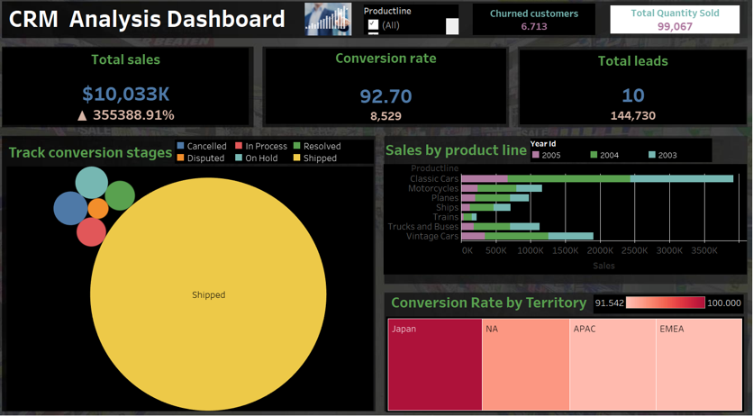
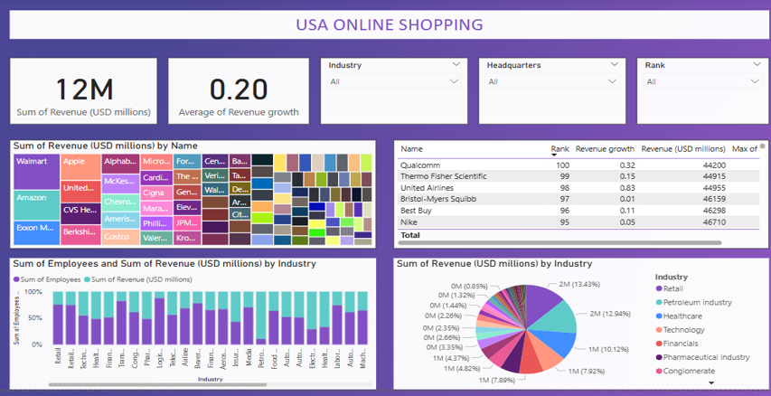

# Internship_Projects
# 📊 Data Analysis Portfolio

This portfolio highlights my data analytics work using **Python**, **Power BI**, and **Tableau**. Each project presents meaningful insights through visual storytelling and data exploration.

---

## 🐍 Python – Superstore Sales Analysis

An end-to-end analysis of Superstore sales data using:

- **Pandas** for data cleaning and aggregation
- **Matplotlib** and **Seaborn** for visual insights

📌 **Key Insights**:
- Technology category shows highest profitability
- Loss trends identified in Furniture across regions

📁 File: `superstore_analysis.pdf
📊 Dataset: Superstore Sales Data

---

## 📈 Tableau – CRM Dashboard

A dashboard to monitor **Customer Relationship Metrics**, featuring:

- Total Sales, Conversion Rates, Total Leads
- Sales breakdown by product line and year
- Conversion rate comparison across global territories

🖼️ 

---

## 📉 Power BI – USA Online Shopping Dashboard

Power BI dashboard analyzing revenue performance of major U.S. retailers:

- Revenue and growth by industry and company
- Employee count and revenue share by industry
- Filters for Industry, Headquarters, and Rank

🖼️ 

---
